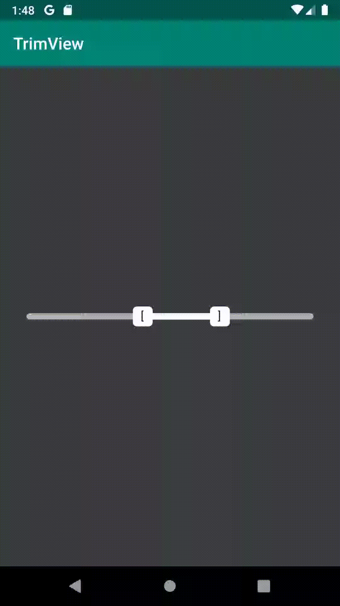

# TrimView for Android
[  ](https://bintray.com/2hamed/maven/TrimView/_latestVersion)

TrimView is a custom view library which is basically a double-sided ProgressBar view. It is best used as a visual controller to cut and trim audio and video files.

### Usage
Just add the following line to your app level gradle file.

```
implementation 'com.hmomeni.trimview:trimview:0.1.0'
```

### Demo


